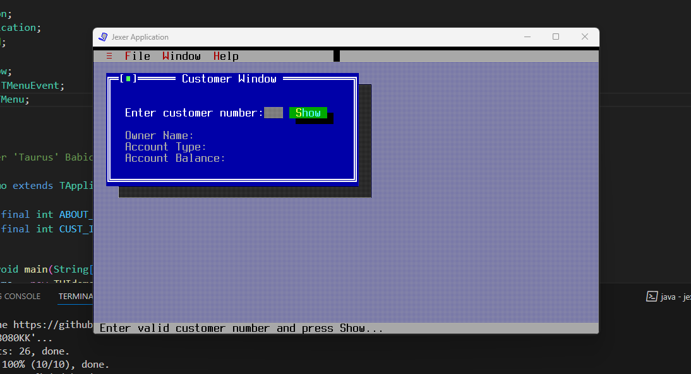
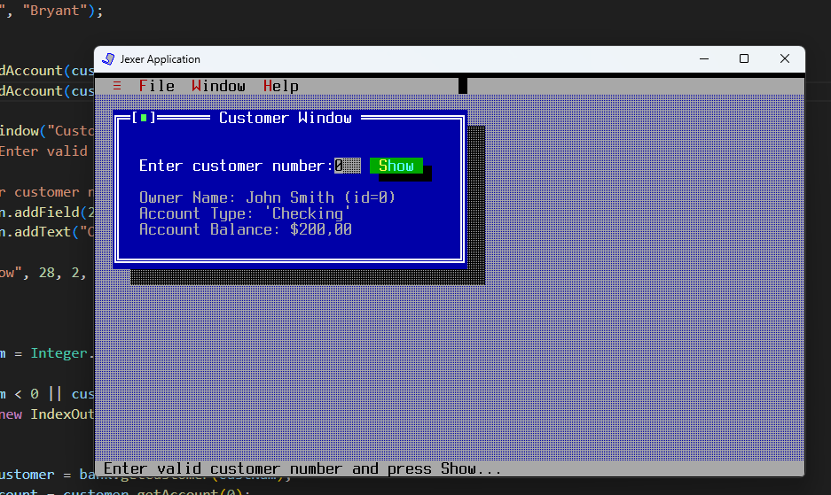
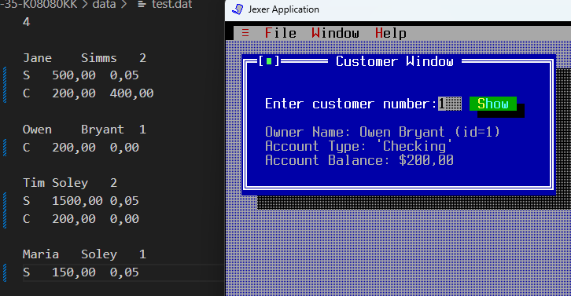

# UI Lab 1
## Jexer
### Завдання
<b>
Завантажте jar-файл Jexer з cайту проекту або з цього ж репозиторію
Створіть в Netbeans новий проект з назвою TUIdemo. УВАГА! Чекбокс Create Main Class треба очистити (не створювати виконуваний клас)!
Додайте до проекту бібліотеку Jexer - правою кнопкой на проекті, обрати Properties, потім у дереві категорій обрати Libraries (другий пункт зверху), натиснути у правій частині вікна кнопку Add JAR/Folder, обрати jar-файл, завантажений у п. 1, натиснути Ok
Додайте до проекту файл TUIdemo.java з цього репозиторію
Вивчіть вихідний код у файлі, впевніться, що ви розумієте як він має працювати.
</b>

### Результат

## MyBank
### Завдання
<b>
Перепишіть метод ShowCustomerDetails з використанням класів Bank, Customer, Account та ін. з наших попередніх лаб - банк повинен мати як мінімум два клієнти, інформацію про яких (та про перші рахунки, що їм належать) ви маєте побачити, увівши номер клієнта. УВАГА! Класи можна взяти або з відповідного репозиторію, або взяти jar-файл з усіма необхідними класами з цього ж репозиторію та підключити його як бібліотеку.
</b>

### Результат

## test.dat
### Завдання
<b>
Перепишіть метод ShowCustomerDetails з використанням класів Bank, Customer, Account та ін. з наших попередніх лаб - інформація про клієнтів банку та їх рахунках має читатись з файлу test.dat (робота номер 8, файл даних також є в цьому ж репозиторію). Інформацію про клієнта (та про перший рахунок, що йому належить) ви маєте побачити, увівши номер клієнта.
</b>

### Результат
